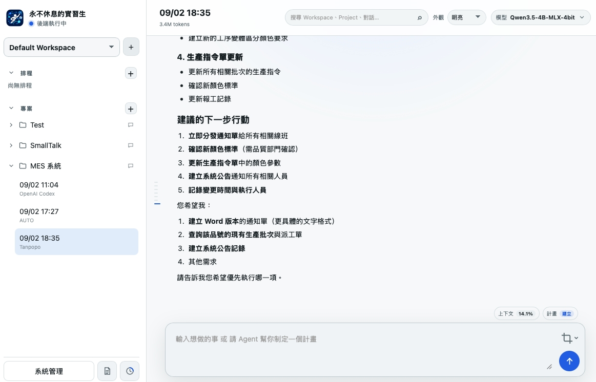

# 休まないインターン

[繁體中文](README.md) · [English](README.en.md) · [日本語](README.ja.md) · [한국어](README.ko.md)

NR-Intern は Go で開発されたデスクトップ AI Agent です。現在の会話、確認済みのツール結果、永続化された状態を基に作業を継続します。単純な依頼は直接処理し、長いタスクは計画を作成して段階的に実行・検証できます。

## 主な機能

- OpenAI-compatible Chat Completions と、ChatGPT／Codex OAuth で認証する OpenAI Codex Responses に対応した拡張可能な Provider Router。Codex アカウントに使用量上限のリセット回数があれば Provider 設定から引き換えでき、確認画面に残り回数と最短の有効期限を表示します。
- 会話ごとに Provider とモデルを選択できる `Workspace → Project → Session` 構造。
- Workspace と Project の常時指示。作業ルールを一度書けば、以降の会話とスケジュールに自動的に引き継がれます。
- 複数の作業計画、ドラッグによる順序変更、ステップ状態、ツール結果に基づく検証証拠。
- Thinking の段階を選択できます。計画をロックして順番に進めるか、解除して未完了の計画を切り替えられます。異なる Session は同時に作業できます。
- 独立したスケジュール欄。繰り返しとサンドボックスを個別に設定し、時刻になると新しい会話を作成して作業を始めます。
- Durable Run、再生可能な SSE、ストリーミング応答、再接続。UI 再起動時に再接続する会話を選択でき、中断した作業には再試行の入口が残ります。
- 異常復旧、任意で有効化できる永続通知センター、Run の一時停止／再開／全件キャンセル、脱敏診断パッケージ。
- グローバル検索、安全なバックアップ／復元、読み取り専用の権限センター。復元前には復元可能なスナップショットを自動保存します。
- 認証情報フィールドを伏せた設定パッケージをダウンロードし、別の端末で Provider、MCP、リバースプロキシ、サービス設定を参照できます。
- 「このアプリについて」ページでバージョン情報と更新を確認できます。
- 会話の実行中も続けて入力でき、後続メッセージはブラウザーの IndexedDB に保存され、前の Run が終わると順番に送信されます。再試行には同じ Idempotency-Key を使います。
- 履歴の文字数上限を備えた Context の自動整理、長期メモリ、メモリ範囲の制御。
- 任意の実験的な共有メモリ機能。好みや決定、手順を再利用し、近似重複の整理、Project 優先の範囲、小さな召回枠、ツール失敗時の追加検索を提供します。
- Run ごとの input／output／total token と、保持中の Run に基づく Session 累計。モデル単価があれば推定コストも表示し、未設定時は token のみです。
- Sandbox と実行承認で保護されたファイル、文書、Shell、SSH、計画ツール。
- メモリ分離プロジェクト：会話、計画、添付、作業ファイルは**書き込み時点で RAM ディスク上**にあり、ディスクを経由しません。アプリ終了時または再起動時に消え、Project 設定だけが残ります。各 Project は容量を設定できる専用 RAM ディスク Sandbox を使用します。このプロジェクトのツール呼び出しは都度承認を求めません。新規作成は実験的機能でオフにできます（既定はオン）。既存のプロジェクトには影響しません。
- 簡易ツールセットでも文書の読み取り・作成・変換に対応し、拡張ツール、ツール検索、native／instruction の呼び出し方式を選択できます。
- 長い会話は索引による分割読み込みを行い、質問のプレビューと移動に対応します。累計は K／M 表記で、マウスを重ねると正確な値を確認できます。
- 非同期処理にはキャンセル可能な `wait_for` を使え、リモートデプロイは `ssh_wait` で読み取り専用の確認を繰り返し、bytes、SHA-256、サービス準備完了を確認してから完了と判定します。
- 外部リソースを読み取る `http_fetch`。HTML は自動で純テキストに変換し、localhost とプライベートアドレスは既定で許可、管理画面から丸ごと無効化できます。
- 内蔵 MCP Client からローカル stdio、レガシー SSE、またはリモート Streamable HTTP Server に接続し、外部ツールにも同じ権限・承認フローを適用します。
- オプションの NetPass リバースプロキシは、デスクトップ制御 UI を公開せずにバックエンド API を公開できます。
- Provider の有効化、モデル検出、ツール権限、監査記録。
- ライト／ダーク表示と、AUTO、繁体字中国語、英語、日本語、韓国語の UI。
- Windows x64、Windows ARM64、macOS ARM64 のデスクトップ環境。
- macOS では起動時からステータス項目を表示します。作業を続けたまま UI を隠し、メニューまたはアプリの再起動操作から元のウィンドウを復元できます。
- Agent に送信しないメモを端末内だけに保存できるメモ帳を、サイドバーから開けます。
- 会話入力欄から画面キャプチャを開始できます。macOS ではシステムの範囲選択後、四角形・直線・文字を追加する編集画面が開き、コピーまたは終了時に編集済み画像でクリップボードを更新します。Windows ではシステムの切り取り UI を開きます。

表示言語は UI と未変更の既定名だけに適用されます。Agent は現在のメッセージ、最近の会話、明示された設定から利用者の慣用言語を判断します。

## はじめに

1. `configs/ai-agent/config.example.json` を基にローカル設定を作成します。
2. Provider endpoint、モデル、必要な認証情報をローカルまたは管理画面で設定します。
3. Workspace、Project、Session を作成し、会話画面からタスクを依頼します。

実際の設定、実行データ、認証情報はバージョン管理に含めないでください。設計の詳細は以下の文書を参照してください。

通知は既定で無効で、一般設定から有効にできます。設定パッケージは会話や添付を含む完全なバックアップではありません。共有前に URL、アカウント名、パスを確認してください。

更新前にバックアップしてください。古い Run、イベント、保留期限を過ぎた無効メモリは自動整理されますが、Session の会話記録は残ります。長期の使用量と監査記録は別途エクスポートし、[保留規則](docs/ai-agent/DEVELOPMENT.md#長對話讀取與儲存維護)を確認してください。

## ドキュメント

[ドキュメントサイトを開く](https://vaderchen.github.io/NR-Intern/)

- [アーキテクチャ](https://vaderchen.github.io/NR-Intern/architecture.html)
- [文書ツール](https://vaderchen.github.io/NR-Intern/document-tools.html)
- [開発ガイド](https://vaderchen.github.io/NR-Intern/development.html)
- [HTTP API](https://vaderchen.github.io/NR-Intern/http-api.html)
- [セキュリティ](https://vaderchen.github.io/NR-Intern/security.html)
- [OpenAPI 契約](https://vaderchen.github.io/NR-Intern/openapi.html)

## データセキュリティ

- Repository に含まれるのはサンプル設定だけです。Provider／OAuth／MCP／NetPass キー、SSH 認証情報、ログ、実行データ、リリース成果物は `.gitignore` で除外されます。
- 文書と例では相対パス、localhost、example domain のみを使用し、開発者固有の絶対ディレクトリを含めません。
- API Key、Token、秘密鍵、証明書、署名 ID、実サービスのアドレスを commit しないでください。

## ライセンス

本プロジェクトはデュアルライセンスです。

- オープンソース利用には [GNU General Public License v3.0 only](LICENSE) が適用されます。
- GPLv3 の条件が適さない商用利用については、[COMMERCIAL-LICENSE.md](COMMERCIAL-LICENSE.md) を参照してください。

第三者コンポーネントには、それぞれ同梱されているライセンスが適用されます。
